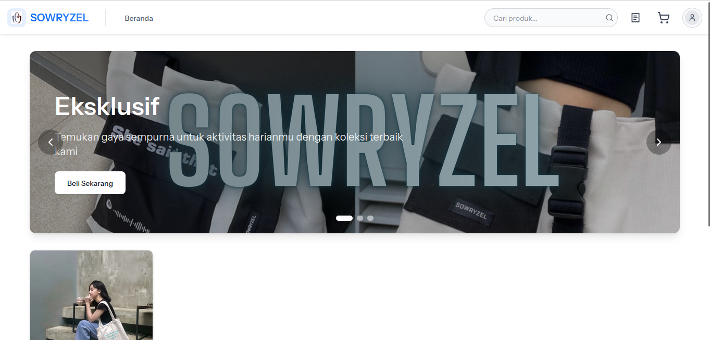
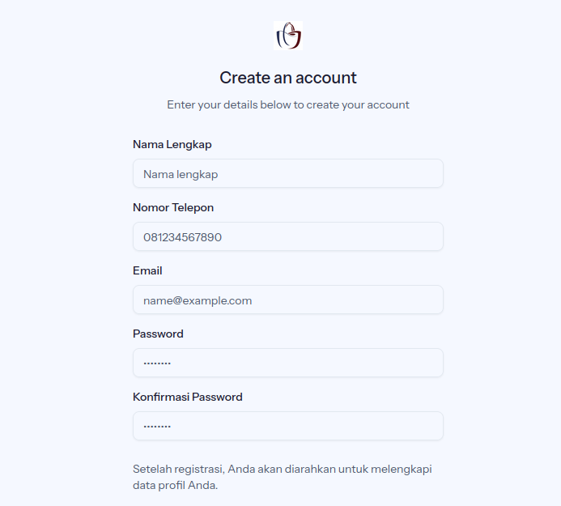

# SOWRYZEL E-Commerce

SOWRYZEL E-Commerce adalah aplikasi penjualan berbasis website. Project ini menggunakan Laravel 12 dan React Starterkit 
## Fitur Utama

- **Beranda:** Tampilan produk terbaru, pencarian produk, dan banner toko.
- **Sign Up:** Formulir pendaftaran pelanggan baru.
- **Login:** Autentikasi pengguna dengan email dan password.
- **Produk:** Daftar produk, detail produk, gambar produk, dan ulasan.
- **Transaksi:** Keranjang belanja, checkout, riwayat transaksi, dan status pembayaran.
- **Admin Dashboard:** Manajemen produk, transaksi, pelanggan, dan laporan penjualan.

## Tampilan UI


1. **Beranda**
   

2. **Sign Up**
   

3. **Login**
   

4. **Produk**
   

5. **Transaksi**
   

6. **Admin Dashboard**
   

## Instalasi

Ikuti langkah berikut untuk menjalankan project ini di lokal Anda:

### 1. Clone Repository

```sh
git clone https://github.com/mahyudindev/sowryzel-ecommerce.git
cd e-commerce-sowryzel
```

### 2. Install Dependency Backend (Laravel)

```sh
composer install
cp .env.example .env
php artisan key:generate
```

### 3. Install Dependency Frontend

```sh
npm install
```

### 4. Konfigurasi Database

Edit file `.env` dan sesuaikan konfigurasi database Anda:

```
DB_DATABASE=your_db_name
DB_USERNAME=your_db_user
DB_PASSWORD=your_db_password
```

### 5. Migrasi & Seeder

```sh
php artisan migrate --seed
```

### 6. Jalankan Server

#### Backend (Laravel)

```sh
php artisan serve
```

#### Frontend (Vite/React)

```sh
npm run dev
```

### 7. Storage Link

```sh
php artisan storage:link
```
